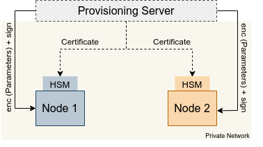

# Provisioning Server for Mutual Authentication

## Introduction

The provisioning server is needed to create the ID, certificates, sign the public key :lock_with_ink_pen: and provide the certificates to the nodes. The server uses GnuPG software for key creation and signing. 

The provisioning Server is only executed **once**, before the mission, only for key generation,  node ID, and mesh parameters provisioning.The node ID is generated from the user input of the MAC address of the node (interface of the mesh). The MAC address is hashed using the blake2s algorithm. The output is a hexadecimal digest of 2 bytes. The ID is obtained with the conversion of the digest as an integer.

The public :key: and private keys :old_key: are stored in separate files nodeIDpb.asc and nodeIDpr.asc. Then both files are transferred (via scp) to the node. This means that **both node and server must be connected to the same Access Point**. 

The mesh parameters are obtained from an already created YAML file, the [mesh_com.conf](https://github.com/tiiuae/mesh_com/blob/feature/develop_pgp/modules/sc-mesh-secure-deployment/src/mesh_com.conf). The mesh IP is randomly generated and verified if it has not been provisioned. 

Also, the server creates a comma-separated value (csv) of all seen nodes. This file is stored in ‘auth/dev.csv' and contains the Node ID, MAC Address, Mesh IP, and Fingerprint of the public key. 



## Run Program
### Normal Execution 
```
./provServer.py
```
It will be asked the MAC address (mesh interface) of the destination node

`` Enter a MAC Address (in the format AA:BB:CC:DD:EE) : ``

and then the IP address for transferring the files:

`Would you like to send the certificates to a node? (yes/no): yes`

`Enter node IP address: 192.168.1.100`

### Cleaning Execution
This will clean all the keys generated as well as the files.

```
./provServer.py -c
```

## Code Flow


Source code
GitHub - https://github.com/tiiuae/configurationservice 

How to use
The whole configuration and provisioning system comprises two discrete components from the functionality perspective; An admin console and the config-service. 

The admin console is the placeholder/server from where all the device configuration parameters can be configured for any incoming client connection. It is to be noted that the admin console host machine and the incoming device request (where the config-service would be running) should be connected over the same access point. 

Installing the configuration and provisioning service:

 Clone the repository: https://github.com/tiiuae/configurationservice

If Host machine/device:   Used as an Admin Console:

  Install MySQL 

  Install Spring Boot | IntelliJ IDEA (jetbrains.com)

  Install Node.js

  Restart the system

  npm install -g @angular/cli@10.0.0

  ng serve: After successful execution, the admin console UI should appear at localhost:4200

  Open the admin console application in IntelliJ IDEA and run the application

  update the root user / PWD in the properties file and create schema admin-console

If Host machine/device:   Used for config-service

Go to the /configurationservice/config-service directory

To create a docker image: docker build -t config_service  (use sudo if not using on comm sleeve)

After successful image building: docker run -d - - network host config_service

Check whether the container is UP and copy the container id: docker ps -a

Executing the config_service: docker exec -it  “container id”  sh

 

The above steps complete the execution at the config_service. Now go to the server webpage, to check for the device. If device ip address does not appear on the list--- ping the device from the server

After Ping, the device will be visible in the list. On the menu set all the desire parameters, save the root certificate and press APPLY

The APPLY will trigger a config.json file which could be seen on the client device. The json file contains all the required parameters. 

If any parameters for the device need to be changed, just go to the admin console ui and change/add the parameters and do a APPLY.

 

Note: After every fresh running remove all the stopped containers via: docker systems prune -a
